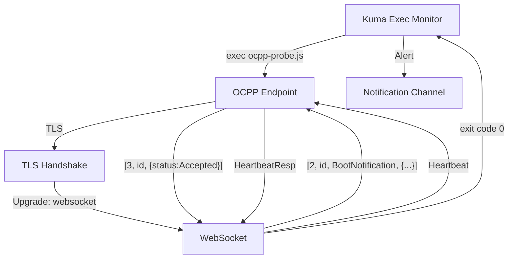

# ADR-001: OCPP WebSocket Monitor

## Context
Electric vehicle charge points communicate with management systems using the Open Charge Point Protocol (OCPP) over WebSocket. Uptime and latency of these WebSocket endpoints are business critical. Uptime‑Kuma currently checks TCP and HTTP but lacks an end‑to‑end OCPP health probe.

## Decision
Implement a custom monitor using Kuma's **exec** mechanism which runs a Node.js script `ocpp-probe.js`. The probe performs a TLS handshake, upgrades to WebSocket with the appropriate OCPP sub‑protocol, sends a `BootNotification` and waits for an `Accepted` response. It then exchanges a `Heartbeat` and measures round‑trip time (RTT). Any failure or timeout exits non‑zero which triggers an alert in Uptime‑Kuma.

When running Kuma via Docker, a compose file can mount the script into the container so no image rebuild is required. If you run `node server/server.js` directly, place the script under `custom-monitors/` and configure an **Exec** monitor through the UI. Future work can leverage PR #5613 (*WebSocket Upgrade Test*) once merged for a native implementation.

## Architecture


*Data flow call‑outs*
1. **TLS handshake** – validates certificates and negotiates encryption.
2. **WebSocket upgrade** – `Sec-WebSocket-Protocol` is set to `ocpp1.6` or `ocpp2.0.1`.
3. **OCPP exchange** – `BootNotification` followed by `Heartbeat`. RTT is logged.
4. **Alert path** – failures propagate via Kuma's notification system (e.g. Slack).

## Feasibility Scan
- **PR #5613 – WebSocket Upgrade Test**: adds native WebSocket probing. As of this ADR the PR is open and not yet released. Using a dev build is possible but not stable.
- **Exec / custom-script monitor**: available in current releases and widely used for custom health checks.

### Decision Matrix
| Option | Pros | Cons |
|-------|------|------|
|Use dev build with PR #5613|No custom script needed|Unstable, not ARM tested|
|Custom exec monitor (this ADR)|Works on stable release, full control|Slightly more setup|
|Upstream contribution|Long term solution, integrates with UI|Requires development and review|

We choose **custom exec monitor** now and plan upstream contribution of a WebSocket‑Keyword monitor supporting sub‑protocols and JSON messages.

## Monitor Configuration Example
The same values can be entered in the **Exec Monitor** form in the UI.
```json
{
  "type": "exec",
  "name": "OCPP Heartbeat",
  "exec": "node /app/custom-monitors/ocpp-probe.js",
  "envs": {
    "WS_URL": "wss://cs.example.com/centralSystem",
    "OCPP_VERSION": "1.6",
    "CHARGE_POINT_MODEL": "kuma-probe",
    "HEARTBEAT_TIMEOUT": "30000"
  },
  "interval": 30
}
```

## Alerting
When the script exits with a non‑zero code, Kuma marks the monitor as down within one interval and triggers configured notifications. RTT can be exported via Prometheus using Kuma's built‑in metrics endpoint.

## Status
Accepted
